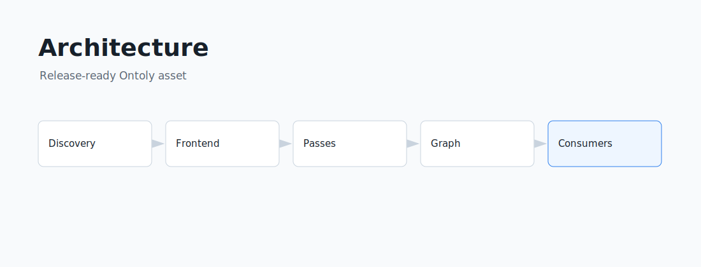

<ProjectHero package="@0xsarwagya/ontoly-cli" status="alpha">
Turn a TypeScript repository into a deterministic Software Graph that every developer tool can share.
</ProjectHero>

Ontoly is a software intelligence engine. It builds a stable semantic graph of a
repository so agents, MCP clients, documentation tools, SDK generators,
architecture tools, and static analyzers can query one source of truth instead
of repeatedly searching files.

Ontoly does not call language models. The graph is deterministic, explainable,
versioned, and portable.

<Install package="@0xsarwagya/ontoly-cli" />

If the alpha package is not published yet, clone the repository and run:

```sh
git clone https://github.com/0xsarwagya/ontoly.git
cd ontoly
corepack enable
pnpm install --frozen-lockfile
pnpm build
pnpm ontoly build examples/basic
```

## The pipeline



```text
Repository
  -> Compiler Frontends
  -> Semantic Model
  -> Software Graph
  -> Query Engine
  -> MCP, Skills, Docs, SDKs, IDEs, Analysis
```

## What it gives you

- deterministic Software Graph JSON
- stable IDs for graph diffing and cache keys
- TypeScript semantic analysis
- graph-native diagnostics
- query APIs for traversal, impact analysis, and dependency lookup
- MCP capabilities for AI coding agents
- portable Agent Skills that teach agents to use Ontoly first
- validation, semantic evaluation, benchmarks, and release gates

## Built for agents, not by agents

The Skill layer teaches workflow. MCP exposes structured capabilities. The graph
itself is still produced by deterministic compiler infrastructure, not model
output.

Browse the public [Agent Skills Catalog](/ontoly/docs/skills) for install
commands, capability mappings, and source references for every official Skill.

## Validation-first alpha

Ontoly includes a validation lab, semantic evaluation harness, skill validator,
package validator, documentation checker, benchmark runner, graph diff tooling,
and release readiness reports. Alpha readiness is based on evidence, not graph
size.

<ProjectLinks
  docs="/ontoly/docs"
  repository="https://github.com/0xsarwagya/ontoly"
  package="https://www.npmjs.com/package/@0xsarwagya/ontoly-cli"
/>
